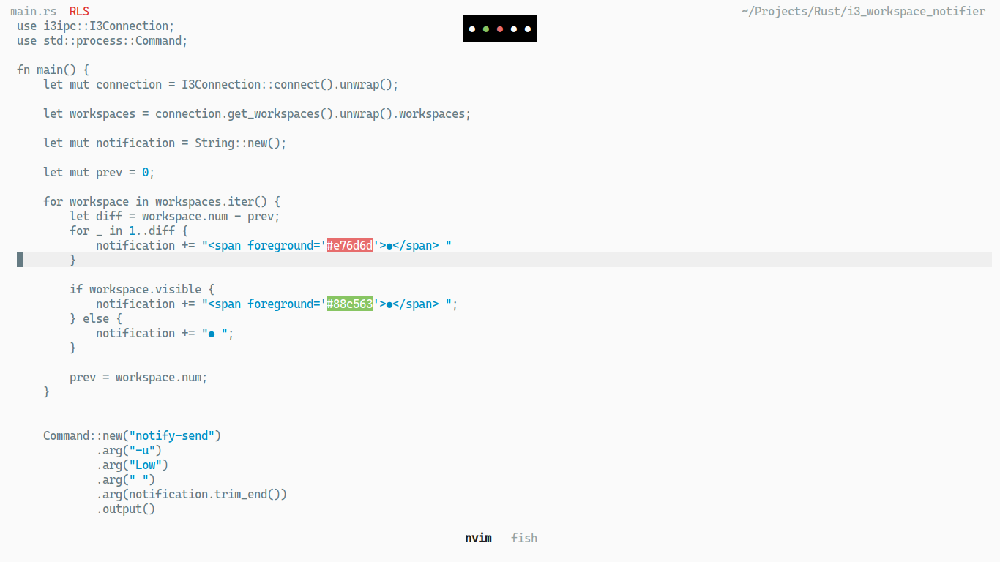

# i3_workspace_notifier
Workspace notifier for i3wm using i3ipc and libnotify. Requires a notification client like dunst to show the workspaces.
Currently visible workspace is shown by a green dot, non-visible workspaces are shown by a white dot, and non-existing workspaces are shown by red dots.

