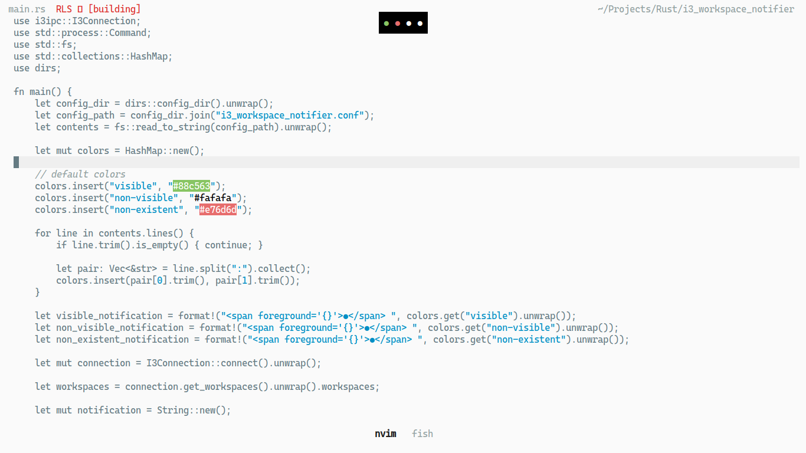

# i3_workspace_notifier
Workspace notifier for i3wm using i3ipc and libnotify. Requires a notification client like dunst to show the workspaces.

Download the binary from the [releases page](https://github.com/rektrex/i3_workspace_notifier/releases).



# Configration
Create `$HOME/.config/i3_workspace_notifier.conf` and set the following options:

  ```
  visible: #88c563
  non-visible: #fafafa
  non-existent: #e76d6d
  ```
  
Visible color is used for the visible workspace, non-visible color is used for workspaces which exist but are not visible, and non-existent color is used for non-existent workspaces between a pair of existing workspaces. Only hex-codes are supported.
